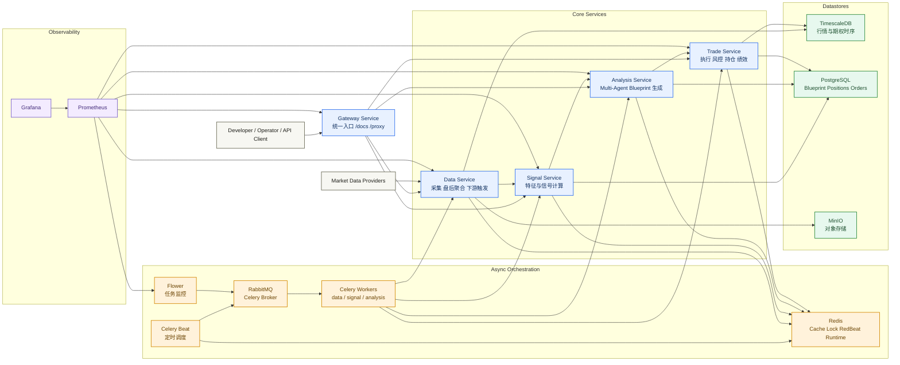
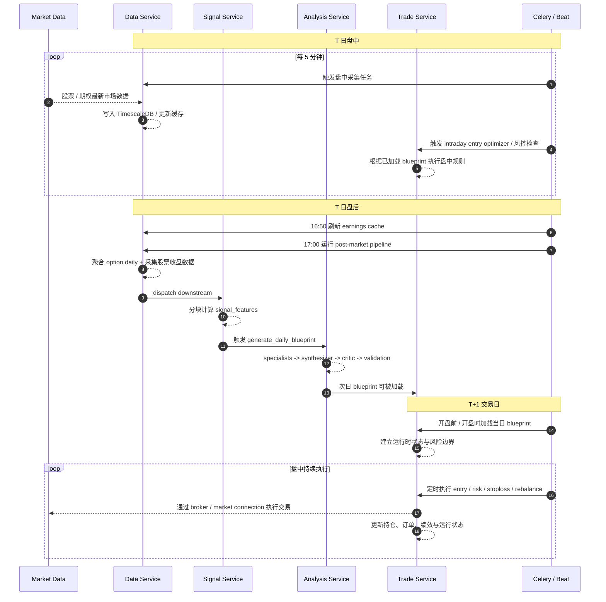

# Algo Trader Platform

一个面向美股期权的微服务量化平台，核心思想是：

- 盘中持续采集市场数据
- 盘后统一计算 signals 和次日 blueprint
- 次日盘中按 blueprint 做机械执行和风控

如果只用一句话概括这个项目：

**data 负责采集，signal 负责特征，analysis 负责生成交易计划，trade 负责执行，gateway 负责统一入口，celery 负责把整条链路自动跑起来。**

> [!WARNING]
> `trade_service` 目前仍处于持续开发阶段，尚未完成完整测试与实盘级验证。
> 当前 README 中关于 trade 的内容应理解为“当前设计与实现方向”，而不是已经完全稳定、可直接用于真实资金交易的最终状态。

## 1. 平台总览

平台由 6 个核心模块组成：

| 模块 | 目录 | 默认端口 | 角色 |
| --- | --- | ---: | --- |
| Data Service | `services/data_service` | 8001 | 市场数据采集、盘后聚合、下游流水线协调 |
| Signal Service | `services/signal_service` | 8002 | 日级特征与信号计算 |
| Analysis Service | `services/analysis_service` | 8003 | Agentic LLM blueprint 生成与校验 |
| Trade Service | `services/trade_service` | 8004 | blueprint 加载、执行、风控、持仓与绩效；当前仍在开发中，未完整测试 |
| Gateway Service | `services/gateway_service` | 8000 | 统一 API 入口、文档聚合、反向代理 |
| Celery Worker | `services/celery_worker` | n/a | worker / beat / flower 的通用运行镜像 |

基础设施：

| 组件 | 默认端口 | 用途 |
| --- | ---: | --- |
| TimescaleDB | 5432 | 时序数据：stock bars、option snapshots、option daily |
| PostgreSQL | 5433 | 业务数据：signal features、blueprints、positions、orders |
| Redis | 6379 | 缓存、分布式锁、RedBeat、运行态共享 |
| RabbitMQ | 5672 / 15672 | Celery broker 与管理界面 |
| Prometheus | 9090 | 指标采集 |
| Grafana | 3300 | 监控面板 |
| Flower | 5555 | Celery 任务与 worker 监控 |

## 2. 从 data 到 trade 的完整链路

### 架构图



平台的主业务链路是：

1. `data_service` 盘中采集股票与期权数据
2. `data_service` 盘后聚合期权日级数据，并采集股票收盘数据
3. `signal_service` 基于 stock / option / benchmark / VIX 数据计算 `signal_features`
4. `analysis_service` 基于 `signal_features` 运行多 agent pipeline，生成 `LLMTradingBlueprint`
5. `trade_service` 加载 blueprint，盘中按规则引擎、风控和 broker 执行
6. `gateway_service` 为所有服务提供统一入口和统一文档
7. `celery_worker` 和 `celery-beat` 负责自动调度这整条链路

### 如何读这张图

- 左到右的主链路是业务链：`data -> signal -> analysis -> trade`
- `gateway` 不参与业务计算，但它是统一 HTTP 入口
- `celery + rabbitmq + redis + beat` 负责自动化调度和异步执行
- `timescaledb` 放时序行情，`postgresql` 放业务状态，职责拆分清晰
- `prometheus + grafana + flower` 负责把服务状态和任务状态可视化

### 图例

- 蓝色：核心业务服务，真正承载 data → signal → analysis → trade 主链路
- 橙色：异步编排与运行时基础设施，负责调度、投递、缓存和 worker 执行
- 绿色：持久化存储，负责保存行情时序、业务状态和对象数据
- 紫色：观测层，负责指标采集、任务可视化和仪表盘展示
- 灰色：外部使用方或外部数据源，不属于平台内部服务边界

## 3. 核心设计思想

### 3.1 盘后智能，盘中机械

平台不是在盘中实时用 LLM 做决策。

需要单独说明的是：这个设计方向已经在仓库中落地了主体框架，但 `trade_service` 仍在开发中，因此“盘中机械执行”这一段目前更适合理解为目标架构，而不是已经完全验收完毕的生产能力。

当前设计是：

- 盘后用批量数据做相对“重”的分析和 blueprint 生成
- 盘中只执行规则、评分、风控和下单

这样做的原因：

- 降低盘中延迟与不确定性
- 避免把 LLM 放在最敏感的实时交易路径上
- 让分析可审计、执行可重复、风控可验证

### 3.2 双数据库模型

- TimescaleDB 存储高频时序与日级行情/期权数据
- PostgreSQL 存储业务实体和运行状态

这是为了把“高吞吐时序读写”和“业务查询/事务逻辑”分开。

### 3.3 微服务 + 统一网关

每个核心域是独立服务，但对使用者来说通常只需要访问 gateway：

- `http://localhost:8000/docs`

### 3.4 任务驱动自动化

所有重任务都通过 Celery 运行，Beat 负责时间驱动的自动化流程。

## 4. 盘后与盘中调度模型

关键调度定义在 `shared/celery_app.py`。

### 交易日时间线图



### 如何读这张时间线

- 第一段是 T 日盘中，重点是“持续采集”和“已有 blueprint 的机械执行”并行发生
- 第二段是 T 日盘后，重点是由 data 发起统一 pipeline，并最终产出 T+1 blueprint
- 第三段是 T+1 交易日，trade service 读取 blueprint 后只做执行、风控和状态更新

### 盘中

- 每 5 分钟采集期权链快照
- 每 5 分钟采集股票盘中数据
- 每 5 分钟运行 intraday entry optimizer

### 盘后

- 刷新 earnings cache
- 运行统一 post-market pipeline
- 由 pipeline 自动触发 signals → blueprint
- 如果启用了 notifier，发送日报

### 盘后流水线

当前统一盘后入口是：

- `data_service.tasks.run_post_market_pipeline`

它会按顺序执行：

1. `aggregate_option_daily`
2. `capture_post_market_chunk` fan-out
3. chord callback `_post_market_finalize`
4. `dispatch_downstream`
5. `signal_service.tasks.compute_signals_chunk` 分块执行
6. `analysis_service.tasks.generate_daily_blueprint`

## 5. 仓库结构

```text
algo-trader-platform/
├── config/                  # 平台配置与监控配置
├── scripts/                 # 初始化、迁移、辅助脚本
├── services/
│   ├── data_service/
│   ├── signal_service/
│   ├── analysis_service/
│   ├── trade_service/
│   ├── gateway_service/
│   └── celery_worker/
├── shared/                  # 共享配置、DB、Celery、模型、工具
├── docker-compose.yml       # 基础设施
├── docker-compose.app.yml   # FastAPI 服务
└── docker-compose.worker.yml # Celery workers / beat / flower
```

## 6. 文档导航

如果你想看各服务的细节，直接看各自 README：

- [services/data_service/README.md](services/data_service/README.md)
- [services/signal_service/README.md](services/signal_service/README.md)
- [services/analysis_service/README.md](services/analysis_service/README.md)
- [services/trade_service/README.md](services/trade_service/README.md)
- [services/gateway_service/README.md](services/gateway_service/README.md)
- [services/celery_worker/README.md](services/celery_worker/README.md)
- [scripts/README.md](scripts/README.md)

## 7. 快速搭建：Local 开发模式

这种模式适合本地调试 Python 代码：基础设施用 Docker，应用和 workers 用 `uv` 在宿主机运行。

### 7.1 准备环境

```bash
cp .env.local.example .env.local
uv sync --all-packages
```

说明：

- 本地 Python 进程大多可以直接使用 `config/config.yaml` 的 localhost 默认值
- `scripts/run_workers.sh` 会优先读取 `.env.local`，如果不存在再回退到 `.env`

### 7.2 启动基础设施

```bash
docker compose up -d
```

这会启动：

- TimescaleDB
- PostgreSQL
- Redis
- RabbitMQ
- MinIO
- Prometheus
- Grafana

### 7.3 初始化数据库与基础数据

```bash
uv run python -m scripts.init_db
uv run python -m scripts.seed_watchlist
```

### 7.4 启动各服务

建议按这个顺序：

```bash
# Terminal 1
uv run uvicorn services.data_service.app.main:app --host 0.0.0.0 --port 8001 --reload

# Terminal 2
uv run uvicorn services.signal_service.app.main:app --host 0.0.0.0 --port 8002 --reload

# Terminal 3
uv run uvicorn services.analysis_service.app.main:app --host 0.0.0.0 --port 8003 --reload

# Terminal 4
uv run uvicorn services.trade_service.app.main:app --host 0.0.0.0 --port 8004 --reload

# Terminal 5
export GATEWAY_DATA_URL=http://127.0.0.1:8001
export GATEWAY_SIGNAL_URL=http://127.0.0.1:8002
export GATEWAY_ANALYSIS_URL=http://127.0.0.1:8003
export GATEWAY_TRADE_URL=http://127.0.0.1:8004
uv run uvicorn services.gateway_service.app.main:app --host 0.0.0.0 --port 8000 --reload
```

### 7.5 启动 Celery workers

最简单的本地方式：

```bash
./scripts/run_workers.sh
```

带 Flower：

```bash
./scripts/run_workers.sh --with-flower
```

也可以手动分开启动：

```bash
uv run celery -A shared.celery_app.celery_app worker -Q data -l info
uv run celery -A shared.celery_app.celery_app worker -Q signal -l info
uv run celery -A shared.celery_app.celery_app worker -Q analysis -l info
uv run celery -A shared.celery_app.celery_app beat -l info
```

## 8. 快速搭建：Docker 模式

这种模式适合快速起整套环境或接近部署环境的联调。

### 8.1 准备环境文件

```bash
cp .env.docker.example .env
```

重要说明：

- Docker 部署依赖 `.env`
- 配置优先级是：环境变量 > `config.yaml`
- 这很重要，因为容器内必须使用 Docker service DNS，例如 `algo_timescaledb`、`algo_postgres`、`algo_redis`

### 8.2 启动基础设施

```bash
docker compose up -d
```

### 8.3 启动应用服务

```bash
docker compose -f docker-compose.yml -f docker-compose.app.yml up -d
```

### 8.4 启动 workers / beat / flower

```bash
docker compose -f docker-compose.yml -f docker-compose.worker.yml up -d
```

### 8.5 启动全栈

```bash
docker compose -f docker-compose.yml -f docker-compose.app.yml -f docker-compose.worker.yml up -d
```

### 8.6 初始化数据库

不论你用 local 还是 docker 启动服务，初始化动作仍然要执行一次：

```bash
uv run python -m scripts.init_db
uv run python -m scripts.seed_watchlist
```

## 9. 常用访问地址

| 入口 | URL |
| --- | --- |
| Gateway Docs | `http://localhost:8000/docs` |
| Data Service Docs | `http://localhost:8001/docs` |
| Signal Service Docs | `http://localhost:8002/docs` |
| Analysis Service Docs | `http://localhost:8003/docs` |
| Trade Service Docs | `http://localhost:8004/docs` |
| RabbitMQ UI | `http://localhost:15672` |
| Prometheus | `http://localhost:9090` |
| Grafana | `http://localhost:3300` |
| Flower | `http://localhost:5555` |

## 10. 新用户最常见的操作

### 10.1 手动触发 signals 计算

```bash
curl -X POST http://localhost:8002/api/v1/signals/compute \
  -H "Content-Type: application/json" \
  -d '{}'
```

### 10.2 手动触发 analysis

```bash
curl -X POST http://localhost:8003/api/v1/analysis \
  -H "Content-Type: application/json" \
  -d '{"symbols": ["AAPL", "MSFT"]}'
```

### 10.3 通过 gateway 查询 signals

```bash
curl "http://localhost:8000/signal/api/v1/signals?symbols=AAPL,MSFT"
```

### 10.4 通过 gateway 查询 trade portfolio

```bash
curl "http://localhost:8000/trade/api/v1/trade/portfolio/snapshot"
```

## 11. 配置模型

平台配置来自两层：

- `config/config.yaml`
- 环境变量覆盖

推荐理解方式：

- `config.yaml` 负责默认值和结构化配置
- `.env.local` / `.env` 负责本地或 Docker 的连接覆盖

尤其在 Docker 场景下，环境变量覆盖是必须的，否则容器会错误地尝试访问 localhost。

## 12. 可观测性

平台默认接入：

- Prometheus 指标采集
- Grafana 可视化
- Flower 监控 Celery
- 结构化日志

每个 API 服务都暴露 `/metrics`。

## 13. 技术栈

- Python 3.11
- FastAPI
- Pydantic v2
- SQLAlchemy Async
- Celery + RabbitMQ + Redis
- TimescaleDB + PostgreSQL
- APScheduler
- Docker Compose
- OpenAI / Copilot SDK（analysis pipeline）

## 14. 快速排障

### 服务起不来

先看：

```bash
docker compose ps
docker compose logs -f
```

### Gateway 能开，但后端接口 502 / 504

通常是：

- 下游服务没启动
- gateway 指向了错误的 `GATEWAY_*_URL`

### API 能用，但任务不执行

通常是：

- 对应 queue 的 worker 没启动
- beat 没启动，所以自动任务没有调度

### Docker 里连接到了 localhost，结果失败

通常是：

- `.env` 没设置好
- 环境变量没有覆盖 `config.yaml`

### blueprint 生成了，但 trade 没动作

需要依次检查：

1. blueprint 是否为 `pending` 而不是 `cancelled`
2. trade service 是否已启动
3. runtime 是否已加载 blueprint
4. 盘中调度器和相关 Celery 任务是否在跑

## 15. 下一步阅读建议

如果你想快速深入代码，推荐顺序：

1. [services/data_service/README.md](services/data_service/README.md)
2. [services/signal_service/README.md](services/signal_service/README.md)
3. [services/analysis_service/README.md](services/analysis_service/README.md)
4. [services/trade_service/README.md](services/trade_service/README.md)
5. [services/gateway_service/README.md](services/gateway_service/README.md)
6. [services/celery_worker/README.md](services/celery_worker/README.md)
7. [scripts/README.md](scripts/README.md)
