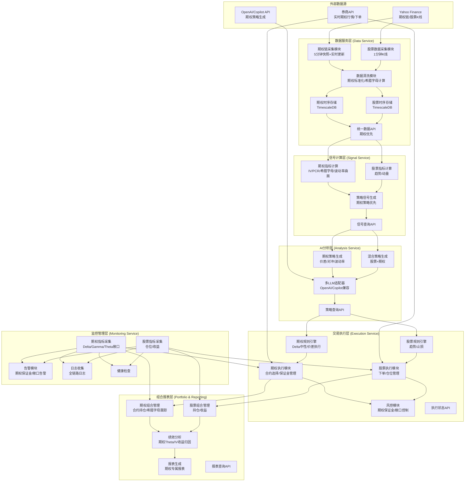
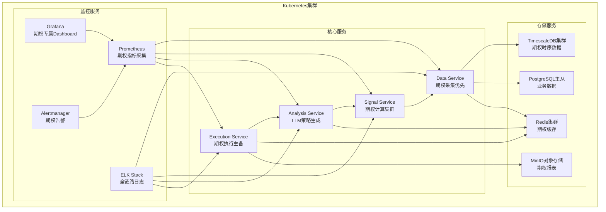

# 期权聚焦型量化交易系统
## 可配置股票组合的混合策略设计文档
**版本：V3.1（盘后智能 + 盘中机械执行版）**  
**核心定位：默认期权策略，盘后生成交易蓝图（llm_trading_blueprint），盘中按规则机械执行**

---

## 一、系统概述
### 1.1 核心特性
- **默认期权策略**：系统默认加载期权专属策略（波动率交易、价差策略、Delta中性对冲）
- **可配置切换**：通过配置文件一键切换为股票策略或股票+期权混合策略
- **期权数据原生支持**：深度集成期权链、希腊字母、IV曲面、期限结构等核心数据
- **AI增强决策**：LLM专门针对期权策略生成结构化交易计划
- **全链路可观测**：期权专属监控指标（Delta敞口、Theta衰减、保证金占用）

### 1.2 支持的核心策略
| 策略类型 | 期权策略（默认） | 股票策略（可配置） | 混合策略（可配置） |
|---------|----------------|------------------|------------------|
| 波动率策略 | 卖权/买权、IV套利、波动率曲面交易 | 股票波动率突破 | 股票底仓+期权波动率对冲 |
| 价差策略 | 垂直价差、日历价差、蝶式/鹰式价差 | 无 | 股票趋势+期权价差增强 |
| 对冲策略 | Delta中性对冲、Gamma对冲、Theta套利 | 股票止损对冲 | 备兑开仓、保护性认沽 |

### 1.3 已确认设计决策（2026-03）
- **运行模式**：采用“盘后智能 + 盘中机械执行”，盘中不调用 LLM。
- **交易蓝图**：Execution Service 于 09:20 从 DB 加载 `llm_trading_blueprint`，盘中仅做条件匹配与执行。
- **数据写入策略**：09:30-16:00 仅缓存（L1 内存 + L2 Parquet），16:30 批量入库，降低交易时段 DB 压力。
- **回填策略（Backfill）**：同时支持“冷启动历史初始化”与“盘中缺口补全”。
- **调度编排**：使用 Celery + Beat，盘后流水线按顺序执行：`batch_flush -> backfill -> compute_signals -> generate_blueprint`。
- **工程结构**：Monorepo 微服务；本地以 Docker Compose 启动，生产再迁移 Kubernetes。

### 1.4 日内调度时间线（最终版）
| 时间 | 任务 | 服务 | 动作 |
|------|------|------|------|
| 09:20 | 启动加载 | Execution | 从 DB 加载 `llm_trading_blueprint` |
| 09:30-16:00（每5分钟） | 规则执行 | Rule Engine + Execution | 拉实时行情、校验蓝图条件、满足则下单 |
| 09:30-16:00（每5分钟） | 数据缓存 | Data Service | 缓存期权全链快照与股票行情（内存/文件） |
| 16:30 | 批量入库 | Data Service | 写入股票 1min 数据 + 期权 5min 快照 |
| 16:35 | 缺口补全 | Backfill Service | 检测缺失时段并回填 |
| 17:00 | 特征计算 | Signal Service | 计算趋势、IV、波动率曲面、PCR 等特征 |
| 17:10 | AI 决策 | Analysis Service | 生成次日交易蓝图并写入 DB |

---

## 二、系统架构分层（期权优先版）


---

## 三、核心配置系统（可切换策略）
### 3.1 核心配置文件（config.yaml）
```yaml
# 交易设置
trading:
    default_strategy_type: "option"    # option / stock / mixed
    timezone: "America/New_York"
    data_fetch_interval: 300            # 5分钟
    execution_interval: 300             # 5分钟

# 期权策略
option_strategy:
    default_strategy: "volatility_smile"
    iv_threshold_high: 70.0             # 高IV优先卖权类策略
    iv_threshold_low: 30.0              # 低IV优先买权类策略
    delta_neutral_tolerance: 0.1
    margin_ratio: 0.2
    max_option_positions: 10

# LLM配置
llm:
    provider: "copilot"                 # openai / copilot

    # ── OpenAI ──
    openai_api_key: ""                  # set via env OPENAI_API_KEY or here
    openai_model: "gpt-4o"
    openai_temperature: 0.1
    openai_max_tokens: 4096

    # ── Copilot SDK ──
    copilot_cli_path: "copilot"         # path to copilot CLI binary
    copilot_github_token: ""            # leave empty to use logged-in user
    copilot_model: "gpt-4o"             # model used inside Copilot session
    copilot_temperature: 0.1
    copilot_max_tokens: 4096

    # ── Common ──
    cache_enabled: true
    cache_ttl: 3600
    skill_dir: ""                       # leave empty to use default (auto-resolved by provider)

# 调度时间表
schedule:
    blueprint_load_time: "09:20"
    market_open: "09:30"
    market_close: "16:00"
    batch_flush_time: "16:30"
    backfill_time: "16:35"
    signal_compute_time: "17:00"
    blueprint_generate_time: "17:10"

# 标的池
watchlist:
    - "AAPL"
    - "MSFT"
    - "NVDA"
    - "TSLA"
    - "SPY"
    - "QQQ"

# 日志
logging:
    level: "INFO"
    format: "json"
```

### 3.2 蓝图数据模型（新增）
- 蓝图表：`llm_trading_blueprint`（按 `trading_date` 唯一）
- 核心字段：`trading_date`、`status`、`blueprint_json`、`execution_summary`
- 执行状态：`pending -> active -> completed/cancelled`
- 蓝图内容支持多腿策略（legs）、入场条件、出场条件、调整规则（adjustment_rules）

### 3.3 数据分片与回填策略（新增）
- **分片策略**：TimescaleDB 以时间（日）为主分片；期权表增加 `underlying + expiry + timestamp` 索引。
- **热数据**：近 90 天高频访问数据；更老数据压缩归档。
- **Backfill-1（冷启动）**：新标的加入时补充最近 90 天历史数据。
- **Backfill-2（缺口补全）**：盘后检测交易时段缺失点并补齐。

---

## 四、各服务详细设计（期权优先）
### 4.1 数据服务层（Data Service）
#### 核心职责
- 期权链5分钟快照+实时更新
- 股票1分钟K线采集
- 期权希腊字母实时计算
- 期权数据标准化与对齐

#### 核心实现
```python
# data_service/greeks.py — 希腊字母计算（py_vollib Black-Scholes 解析式）
from py_vollib.black_scholes.greeks.analytical import delta, gamma, theta, vega, rho

DEFAULT_RISK_FREE_RATE = 0.045  # 美国 10Y 国债收益率近似

def compute_greeks(flag: str, S: float, K: float, T: float, r: float, sigma: float):
    """计算单个合约 Greeks（flag='c'/'p', T=年化到期时间, sigma=IV）"""
    if T <= 0 or sigma <= 0 or S <= 0 or K <= 0:
        return {"iv": sigma}  # 无效参数 → 仅保留 IV
    return {
        "delta": delta(flag, S, K, T, r, sigma),
        "gamma": gamma(flag, S, K, T, r, sigma),
        "theta": theta(flag, S, K, T, r, sigma),
        "vega":  vega(flag, S, K, T, r, sigma),   # py_vollib 已返回每1%IV变动
        "rho":   rho(flag, S, K, T, r, sigma),
        "iv":    sigma,
    }

# data_service/option_fetcher.py — 采集后自动附加 Greeks
def enrich_snapshot_greeks(snapshot):
    """遍历快照中每个合约，调用 py_vollib 计算并回填 Greeks"""
    S = snapshot.underlying_price
    for contract in snapshot.contracts:
        flag = "c" if contract.option_type == "call" else "p"
        T = contract.days_to_expiry / 365.0
        contract.greeks = compute_greeks(flag, S, contract.strike, T, 0.045, contract.greeks.iv)
```

### 4.2 信号计算层（Signal Service）
#### 核心职责
- 期权IV百分位、PCR比率、波动率微笑计算
- 期权期限结构、曲面构建
- 股票趋势、动量指标计算
- 期权策略信号生成

#### 核心实现
```python
# signal_service/option_indicator.py
import pandas as pd
import numpy as np

def calculate_iv_rank(option_data: pd.DataFrame, lookback_days: int = 30) -> float:
    """计算IV百分位"""
    current_iv = option_data['iv'].mean()
    historical_iv = get_historical_iv(option_data['underlying'].iloc[0], lookback_days)
    return np.percentile(historical_iv, current_iv)

def calculate_volatility_smile(option_data: pd.DataFrame) -> pd.DataFrame:
    """计算波动率微笑"""
    smile = option_data.groupby(['expiry', 'strike'])['iv'].mean().unstack()
    return smile

def generate_option_signal(option_data: pd.DataFrame, config: dict) -> dict:
    """生成期权策略信号"""
    iv_rank = calculate_iv_rank(option_data)
    pcr = option_data[option_data['type'] == 'put']['volume'].sum() / option_data[option_data['type'] == 'call']['volume'].sum()
    
    signal = {}
    if iv_rank > config['iv_threshold']:
        signal['strategy'] = 'sell_option'  # 高IV卖权
        signal['confidence'] = iv_rank
    elif iv_rank < config['iv_threshold']:
        signal['strategy'] = 'buy_option'  # 低IV买权
        signal['confidence'] = 1 - iv_rank
    else:
        signal['strategy'] = 'spread_strategy'  # 价差策略
        signal['confidence'] = 0.5
    
    signal['pcr'] = pcr
    signal['iv_rank'] = iv_rank
    return signal
```

### 4.3 AI分析层（Analysis Service）
#### 核心职责
- 期权策略生成（价差、对冲、波动率）
- 股票+期权混合策略生成
- 多LLM适配器（OpenAI/Copilot兼容）

#### 核心实现

实际实现位于 `services/analysis_service/app/llm/`：

| 文件 | 说明 |
|------|------|
| `base.py` | `LLMProviderBase` 抽象基类（`generate_blueprint` + `health_check`） |
| `openai_provider.py` | OpenAI Responses API + 内联 skill bundle（base64 zip） |
| `copilot_provider.py` | Copilot SDK + `skill_directories` 原生挂载 |
| `adapter.py` | `LLMAdapter` 统一入口：按 `config.llm.provider` 选主 provider，失败自动回退另一个 |
| `prompts.py` | 构建 `build_blueprint_prompt`，将 `SignalFeatures` 序列化为 LLM 输入 |

每个 provider 独立读取自身配置：
- **OpenAI** → `openai_model` / `openai_temperature` / `openai_max_tokens`
- **Copilot** → `copilot_model` / `copilot_temperature` / `copilot_max_tokens`

```python
# adapter.py — 简化示意
class LLMAdapter:
    def __init__(self):
        settings = get_settings()
        self.primary = self._create_provider(settings.llm.provider)
        self.secondary = self._create_secondary(settings.llm.provider)

    async def generate_blueprint(self, signal_features, ...):
        try:
            return await self.primary.generate_blueprint(signal_features, ...)
        except Exception:
            if self.secondary:
                return await self.secondary.generate_blueprint(signal_features, ...)
            raise
```

### 4.4 交易执行层（Execution Service）
#### 核心职责
- 期权规则引擎（Delta中性、价差执行）
- 期权执行模块（合约选择、保证金管理）
- 实时风控（期权保证金、敞口控制）

#### 核心实现
```python
# execution_service/option_executor.py
import pandas as pd
from data_service.data_api import get_option_chain

class OptionExecutor:
    def __init__(self, broker_api):
        self.broker_api = broker_api
    
    async def place_option_order(self, strategy: OptionStrategy):
        """下单期权合约"""
        # 选择最优合约
        option_chain = await get_option_chain(strategy.underlying, strategy.expiry)
        best_option = option_chain[
            (option_chain['strike'] == strategy.strike) &
            (option_chain['type'] == strategy.option_type)
        ].iloc[0]
        
        # 保证金检查
        margin_required = best_option['lastPrice'] * strategy.quantity * 100 * 0.2  # 20%保证金
        if not await self.risk_manager.check_margin(margin_required):
            raise Exception("保证金不足")
        
        # 下单
        order_id = await self.broker_api.place_order(
            symbol=best_option['symbol'],
            side='sell' if strategy.strategy_type == 'sell_option' else 'buy',
            quantity=strategy.quantity,
            price=best_option['lastPrice']
        )
        
        # Delta中性对冲
        if strategy.delta_neutral:
            await self.hedge_delta(strategy.underlying, best_option['delta'], strategy.quantity)
        
        return order_id
    
    async def hedge_delta(self, underlying: str, delta: float, quantity: int):
        """Delta中性对冲"""
        stock_price = await self.broker_api.get_realtime_price(underlying)
        hedge_quantity = int(delta * quantity * 100)  # 1期权合约对应100股
        if hedge_quantity > 0:
            await self.broker_api.place_order(
                symbol=underlying,
                side='sell',
                quantity=hedge_quantity,
                price=stock_price
            )
        elif hedge_quantity < 0:
            await self.broker_api.place_order(
                symbol=underlying,
                side='buy',
                quantity=-hedge_quantity,
                price=stock_price
            )
```

---

## 五、部署架构（期权优先）


---

## 六、期权专属监控Dashboard
### 6.1 核心监控指标
| 指标类别 | 核心指标 | 告警阈值 |
|---------|---------|---------|
| 期权敞口 | Delta敞口、Gamma敞口、Theta敞口 | Delta>0.5、Gamma>0.1 |
| 波动率指标 | IV百分位、PCR比率、波动率微笑斜率 | IV>0.3、PCR>2 |
| 保证金监控 | 保证金占用率、可用保证金 | 保证金占用率>80% |
| 绩效指标 | Theta收益、IV收益、Gamma收益 | 日Theta收益<-100 |

### 6.2 告警规则
```yaml
# alertmanager.yml
groups:
  - name: option_alerts
    rules:
      - alert: HighDeltaExposure
        expr: option_delta_exposure > 0.5
        for: 5m
        labels:
          severity: warning
        annotations:
          summary: "Delta敞口超限"
          description: "当前Delta敞口: {{ $value }}"
      
      - alert: MarginUsageHigh
        expr: option_margin_usage > 0.8
        for: 2m
        labels:
          severity: critical
        annotations:
          summary: "保证金占用过高"
          description: "当前保证金占用率: {{ $value }}"
```

---

## 七、总结
本系统在“期权优先”策略框架下，已明确采用“盘后智能 + 盘中机械执行”的生产化路径：盘后计算特征并生成次日蓝图，盘中只进行条件匹配与执行，降低交易时段耦合和故障面。

当前仓库已完成基础骨架实现：`shared` 公共层、7 个核心服务（Data/Backfill/Signal/Analysis/Execution/Portfolio/Monitoring）、Celery 调度、双数据库初始化与运行脚本。后续应重点推进：
- 实盘券商接入（当前为 Paper Trading 抽象层）
- 回测引擎与仿真撮合增强
- 端到端测试、告警联动、K8s 生产部署

本文档中的代码片段用于说明架构与接口意图；具体实现以仓库代码为准。