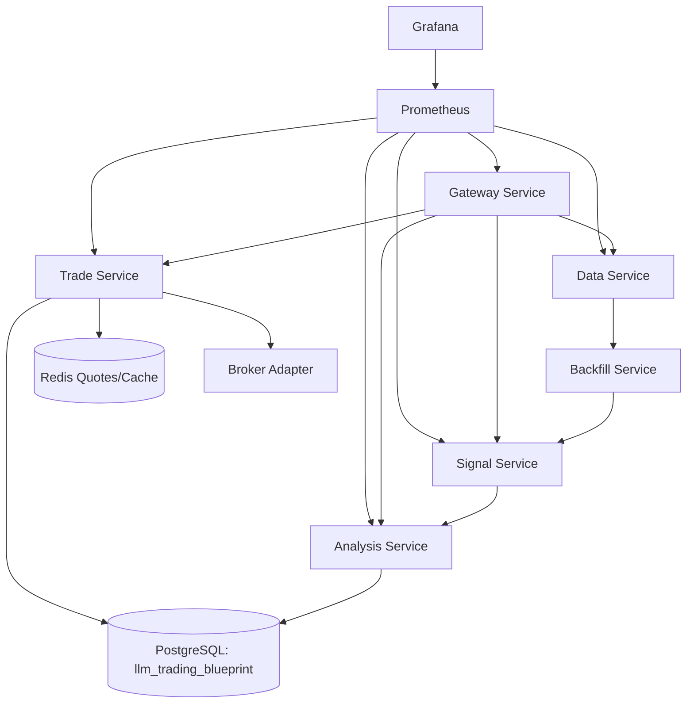

# 期权聚焦型量化交易平台设计文档
## 盘后智能 + 盘中机械执行（当前代码对齐版）

**版本：V4.0（2026-03）**  
**范围：与当前仓库实现一致，不包含未落地能力的扩展设计**

---

## 一、设计目标与运行边界

### 1.1 核心目标
- 盘后批量计算信号并由 LLM 生成次日交易蓝图。
- 盘中仅执行机械规则与风险控制，避免盘中 LLM 调用。
- 以期权策略为主，同时保留股票维度数据与风控视角。

### 1.2 运行边界
- 默认数据源为 `yfinance`（配置可切换 provider 字段，但当前实现主路径为 yfinance）。
- 默认 broker 为 `paper`；`futu` 为已接入接口骨架（未完成真实下单实现）。
- gRPC proto 已维护，但当前主运行链路是 FastAPI + Celery。

---

## 二、当前实现架构（代码实际结构）

### 2.1 服务拆分
| 服务 | 目录 | 主要职责 |
|------|------|----------|
| Data Service | `services/data_service` | 行情采集、缓存与盘后入库 |
| Backfill Service | `services/backfill_service` | 缺口检测与历史回填 |
| Signal Service | `services/signal_service` | 指标与信号计算 |
| Analysis Service | `services/analysis_service` | LLM 蓝图生成（Agentic 多智能体） |
| Trade Service | `services/trade_service` | 执行调度、止损风控、持仓与绩效 |
| Gateway Service | `services/gateway_service` | API 聚合与反向代理 |

补充：监控不再拆分为独立服务。每个 API 服务各自暴露 `/metrics`，统一由 Prometheus 抓取，并可通过 Grafana 展示。

### 2.2 Trade Service 内部结构（合并后）
- `app/execution/`：蓝图加载、路由、规则评估、调度任务。
- `app/execution/risk/`：风控引擎、仓位采集、止损监控。
- `app/portfolio/`：持仓查询、组合快照、绩效统计。
- `app/broker/`：`paper` 与 `futu` broker 适配层。
- `app/audit.py`：执行事件审计写入 `execution_events`。

### 2.3 总体调用关系


---

## 三、调度模型（当前实现）

### 3.1 盘后流水线（Celery）
由 `data_service.tasks.run_post_market_pipeline` 触发链式任务：
1. `capture_post_market_data`（Data）
2. `batch_flush_to_db`（Data）
3. `detect_and_backfill_gaps`（Backfill）
4. `compute_daily_signals`（Signal）
5. `generate_daily_blueprint`（Analysis）

### 3.2 独立定时任务
- `check_historical_gaps`（Backfill，日常历史完整性检查）。

### 3.3 盘中执行循环（Trade Service）
- `execution.scheduler` 按 `trading.execution_interval` 调度。
- 每个 tick 包含：
  - 风控止损检查（`execution/risk/risk_monitor.py`）
  - 行情读取与规则评估（当前规则引擎为机械判断框架）

---

## 四、配置体系（当前 `config/config.yaml`）

### 4.1 分层结构
- `infrastructure`：`database` / `redis` / `rabbitmq` / `minio`
- `broker`：`type` + `paper` + `futu`
- `services`：`data_service` / `option_strategy` / `llm`
- `trading`：`trading` / `risk` / `schedule` / `watchlist`
- `observability`：`logging`（当前代码）

补充：指标采集采用服务内嵌式 Prometheus 模式，当前 `config/config.yaml` 尚未抽象出独立 metrics 配置节；Prometheus 抓取目标定义在 [config/prometheus.yml](config/prometheus.yml)。

### 4.2 LLM 配置（已嵌套）
```yaml
llm:
  provider: "copilot"
  openai:
    api_key: ""
    model: "gpt-4o"
    temperature: 0.1
    max_tokens: 8192
  copilot:
    cli_path: "copilot"
    github_token: ""
    model: "gpt-4o"
    reasoning_effort: "medium"
```

### 4.3 风控与 broker 配置
```yaml
broker:
  type: "paper"   # paper | futu

risk:
  stop_loss:
    enabled: true
    check_interval_seconds: 60
    portfolio_loss_limit: 2000.0
    position_loss_limit: 500.0
    cooldown_seconds: 60
```

---

## 五、协议与接口

### 5.1 REST API（主运行面）
- Data: `/api/v1/*`
- Signal: `/api/v1/*`
- Analysis: `/api/v1/*`
- Trade: `/api/v1/trade/*`
- Gateway: 聚合各服务 OpenAPI 并反向代理
- Metrics: 各服务独立暴露 `/metrics`，由 Prometheus 抓取

### 5.2 Proto（已与 trade 语义统一）
`proto/` 当前包含：
- `data_service.proto`
- `signal_service.proto`
- `trade_service.proto`

其中 `trade_service.proto` 标识为：
- `package algo_trader.trade`
- `option go_package = "algo_trader/trade"`
- `service TradeService`

---

## 六、数据存储模型（当前重点）

### 6.1 TimescaleDB（时序）
- `stock_1min_bars`
- `option_5min_snapshots`
- `stock_daily`
- `option_daily`

### 6.2 PostgreSQL（业务）
- `llm_trading_blueprint`
- `signal_features`
- `orders`
- `positions`
- `backfill_logs`
- `watchlist_symbols`
- `execution_events`（审计事件）

---

## 七、风险控制与审计

### 7.1 止损策略（当前实现）
- 支持组合级止损与单仓位止损。
- 风控检查节拍独立于执行节拍（由 `risk.stop_loss.check_interval_seconds` 控制）。
- 支持 symbol 级 cooldown，避免短时间重复触发。

### 7.2 仓位来源优先级
1. broker 实时仓位（优先）
2. trade portfolio 聚合仓位（兜底来源）

### 7.3 审计
- 风控触发与订单结果写入 `execution_events`。
- 审计写入失败不会阻塞交易主路径（best-effort）。

---

## 八、部署与运行

### 8.1 本地部署
- 编排：`docker-compose.yml`
- 运行模式：基础设施常驻，应用服务通过 `app` profile 启动。
- Python 依赖：`uv` workspace（根 + 各服务 package）。

### 8.2 运行入口
- API 服务：FastAPI + Uvicorn
- 异步任务：Celery Worker + Beat
- 指标：各服务 `/metrics` + Prometheus
- 可视化：Grafana
- 日志：结构化日志（json/console，可配置文件滚动）

---

## 九、当前状态与后续重点

### 9.1 已落地
- Execution + Portfolio 合并为 `trade_service`。
- 风控模块拆分至 `execution/risk`。
- broker 工厂 + `paper` 默认实现 + `futu` 骨架。
- proto 文件与命名统一到 `trade_service.proto` / trade 语义。

### 9.2 待增强（不影响当前主流程）
- `futu` 实盘适配的完整 SDK 调用链。
- 更完整的规则模板与多策略执行编排。
- 各服务定制业务指标与告警规则。
- 端到端集成测试、回测闭环与生产级告警联动。

---

本文档以当前仓库代码为准；后续架构变更应同步更新本文件与 `README.md`。
